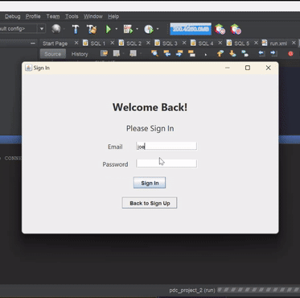

# Wordle GUI Game

Our Java-based Wordle game, developed in NetBeans 14 and compatible with Java 11, is an enhancement of our previous CLI-based Wordle game by improving the word-guessing experience with an interactive GUI. Players have six attempts to guess a random secret word, enhancing the classic gameplay with an engaging visual interface. This project incorporates an embedded database, allowing for the saving and reviewing of game and player histories, providing players with an overview of their performance. 

## Authors
- [nooswa](https://github.com/nooswa)
- [larissagoh](https://github.com/larissagoh)

## Features
- **Interactive GUI**: Experience smooth and engaging gameplay through an intuitive graphical user interface.
- **Hint System**: Receive feedback on invalid guesses as well as color-coded hints for each guess:
  - **Green** indicates a correct letter in the correct position.
  - **Yellow** shows a correct letter in the wrong position.
  - **Grey** denotes an incorrect letter.
- **Score and History Tracking**: Game scores are saved, giving players a breakdown of their overall performance through an embedded history file.
- **Play Again Option**: Easily restart the game after each round.
- **Sign-out Option**: Allow for the option to sign out after, before and during each round.

## Demo

